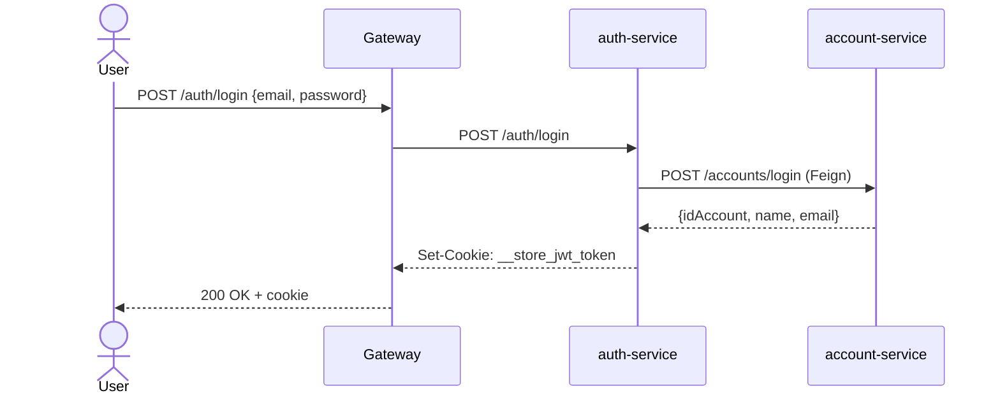

# Endpoints

| Método | Path | Descrição |
|---|---|---|
| `POST` | `/accounts` | Cria conta. Body: `{name, email, password}` (sem hash). Internamente armazena `password_sha256`. Retorna `201 Created`. |
| `POST` | `/accounts/login` | Verifica credenciais. Body: `{email, password}`. Retorna `{idAccount, name, email}` em `200 OK` ou `401 Unauthorized`. |
| `GET` | `/accounts/health-check` | Liveness/readiness — rota aberta no gateway. |
| `GET` | `/actuator/prometheus` | Métricas Prometheus (latência, GC, JVM, Hikari). |

## Auth flow

